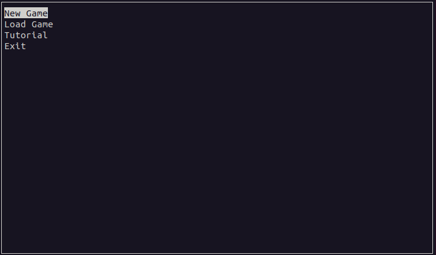
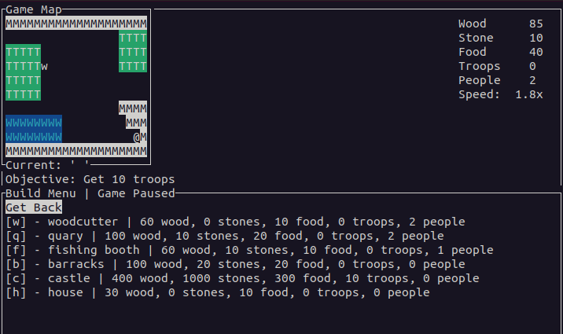

# Building Strategy Game
This is a building strategy game made in C++ terminal using [ncurses](https://invisible-island.net/ncurses/announce.html) library. It was developed as a semestral work for course BI-PA2. Task is defined in `zadani.txt`.

## Documentation
You can generate a documentation using Doxygen:
```doxygen Doxyfile``` or ```make doc```

## Compilation
To compile this application you can use

```make compile``` after that run the game using ```make run```

Also make sure you have [ncurses](https://invisible-island.net/ncurses/announce.html) library installed.

## Gameplay

###  Controls
In game, you are moving using your arrow keys to move `@` (your in-game cursor). To open Build menu press Enter and to open Pause Menu press Esc, to choose any option press Enter.

### Starting game
Starting a game is simple - from Main menu choose `New game`, choose Map you want to play and then type game name - this name will be used to load your game later.

### Saving / Loading your game
You can load your old game from Main menu - option `Load game` using the name you used to start the game.

To save your current game press Esc (Pause menu should open) and choose Save game.

### Goal of the game
There are different goals for each map. You will see them after you have started the game.

### How to play
Map is always a grid with predefined layout - there are different fields: trees (T), mountains (M) and water (W). You can build your buildings near these fields, their production will depend on how many of the fields are directly around your building.

For example
```
TT
TW

```
this woodcutter (W) will produce wood from 3 trees.
```
TT
T  W

```
this woodcutter will not produce anything.

### Buildings
There are different buildings, each having different purpose and different requirements for you to build it.
- (w)oodcutter - generates wood
- (q)uary - generates stone
- (f)ishing booth - generates food
- (b)arracks - can train soldiers
- (c)astle
- (h)ouse - houses people

## Screenshots
### Main menu

### In-game
